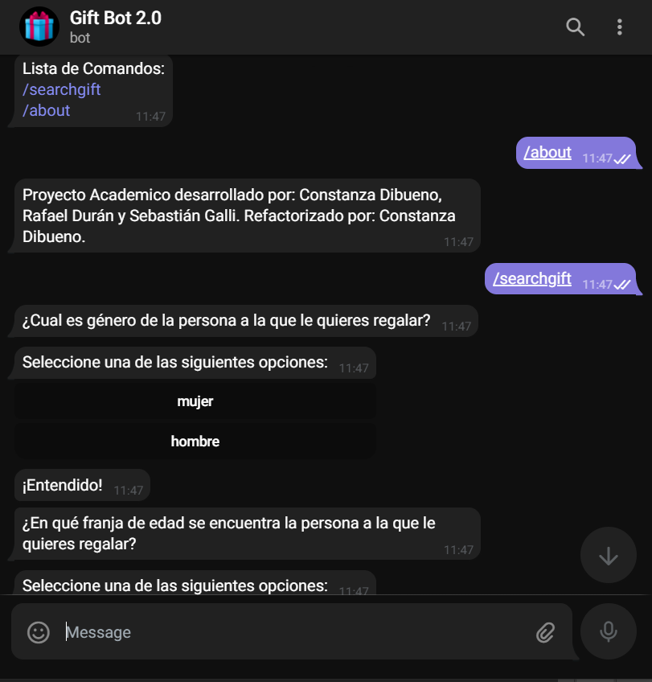

# PII UCU - Proyecto Final de Curso - Telegram ChatBot


Llega el día del cumpleaños de la persona más importante para tí y suele pasar que no sabemos qué regalar. ¡No te preocupes! GiftBot es tu mejor asistente. Él te ayudará a construir un perfil basado en determinadas preguntas y te hará fantásticas sugerencias para tu próximo regalo.

<p align="center">
  
</p>

## ¿Como encuentro a GiftBot?

Podés buscarlo como Gift Bot 2.0 con usuario @TheNewGiftBot. Actualmente el bot corre de forma local.

## ¿Cómo funciona GiftBot?
Desde un conjunto de archivos externos se extrae la información necesaria para crear bancos que almacenan distintas clases de categorías de preguntas, las cuales se clasifican como Initial, Main, Mixed y Specific y que también corresponden a distintas fases del mismo nombre. 

Por lo tanto, GiftBot funciona en fases.

Las preguntas clasificadas como Initial están orientadas a recolectar información básica y general sobre la persona a quien se quiere regalar (tales como por ejemplo género y rango de edad). Las preguntas clasificadas como Initial están ideadas exclusivamente para guardar información que no está directamente relacionada con el producto final, pero aún así es información que enriquece los criterios de búsqueda del regalo acorde a las preferencias del usuario y las características generales de la persona a quien se quiere regalar.

Las preguntas clasificadas como Initial son las primeras en interactuar con el usuario una vez que se inicia el procedimiento para la recomendación de regalos y corresponden a la primera fase del programa. Cada una de estas preguntas cuenta con respuestas preestablecidas entre las cuales el usuario debe elegir. La opción de respuesta a cada pregunta seleccionada por el usuario se almacena en lo que llamamos un Perfil de Persona. 

```
Ejemplo de formato de archivo de preguntas clasificadas como Initial:
¿Cual es género de la persona a la que le quieres regalar?;1-mujer,2-hombre
```

Las categorías clasificadas como Main almacenan una afirmación identificadora que representa una categoría general de productos. Una categoría Main es el nivel más amplio o genérico en el que se puede clasificar una categoría (Ejemplos: Home, Sport, Technology).

Las categorías clasificadas como Main son las segundas en interactuar con el usuario y corresponden a la segunda fase del programa. Entre una lista de afirmaciones, el usuario debe elegir aquellas dos afirmaciones que sean más acorde a la persona a quien quiere regalarle. Las dos categorías Main seleccionadas por el usuario a partir de las afirmaciones se almacenan en el antes mencionado Perfil de la Persona.

```
Ejemplo de formato de archivo de preguntas clasificadas como Main:
Le gusta quedarse en casa;1-home
Es hábil para el bricolage;2-tool
Le gusta la tecnología;3-technology
``` 
Las categorías clasificadas como Mixed almacenan preguntas asociadas a la combinación de dos categorías Main, donde además cada pregunta representa una categoría más específica dentro de dicha combinación de dos categorías Main.

Las categorías clasificadas como Mixed son las terceras en interactuar con el usuario y corresponden a la tercera fase del programa. A partir de las dos categorías Main seleccionadas por el usuario, se realiza una búsqueda de las categorías Mixed que están asociadas a la combinación de dichas categorías Main. A partir de ello, se muestra un conjunto de preguntas nuevas que el usuario debe responder con “si” o “no”.

```
Ejemplo de formato de archivo de preguntas clasificadas como Mixed:
home;technology;¿Le gusta usar redes sociales?;cellphone;1-si,2-no
```

Las categorías clasificadas como Specific almacenan preguntas asociadas a un producto puntual (o una gama de productos).

Las categorías clasificadas como Specific son las últimas en interactuar con el usuario y corresponden a la cuarta fase del programa. A partir de aquellas preguntas Mixed a las que el usuario haya respondido "si", se muestra un nuevo conjunto de preguntas a las cuales el usuario debe responder con “si” o “no”. 

```
Ejemplo de formato de archivo de preguntas clasificadas como Specific:
cellphone;¿Le gusta sacar fotos?;selfie stick;1-si,2-no
```
Finalmente, aquella o aquellas preguntas clasificadas como Specific que hayan obtenido como respuesta un "si", devolverán un producto que posteriormente va a ser ingresado a una búsqueda en Mercado Libre.

## ¿Puedo agregar más preguntas al Gift Bot?
Si, es posible agregar, modificar o retirar preguntas a cada una de las distintas fases del bot a través de archivos externos configurables. Actualmente GiftBot lee toda esta información de archivos .txt, pero el sistema está diseñado para que sea posible implementar lectura de otro tipo de archivos. Pero por el momento, si quieres modificar, agregar o retirar preguntas, solamente debes editar los archivos .txt en la carpeta de Assets, procurando seguir el formato correspondiente y que cuentes con una pregunta en las fases anteriores que permita al GiftBot llegar hasta tu pregunta. Todos los archivos .txt de fases de preguntas son configurables y extensibles.

## Comentarios sobre el desarrollo
- Se implementó un sistema para que el bot lea los archivos externos y cree la cadena de responsabilidad de fases una sola vez antes de iniciar la API de Telegram por razones de optimización.
- Para testear las fases de preguntas y sus StateHandlers se implementó una emulación de respuestas generadas en la clase TestAnswerReceiver (de tipo IMessageReceiver) para poder trabajar los casos de test que requerían un ingreso de información por parte del usuario.

#### Aclaraciones
- En caso de ejecutar dotnet test, tener en cuenta que los casos de test tienen un cierto tiempo de demora.
- Luego de clonar el repositorio y abrirlo por primera vez es necesario realizar dotnet restore en la carpeta Program y en la carpeta Library.Test.
- Proyecto desarrollado en .NET 5.0


